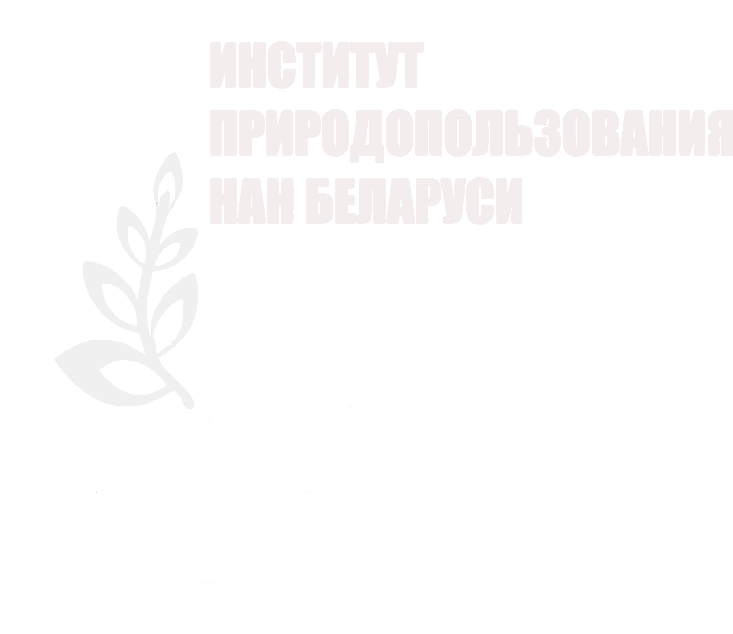

# Сайт Института природопользования НАН Беларуси

## ✨ Описание

<p align="center">

</p>

Данный проект создавался на замену сайта Института природопользования НАН Беларуси. По сравнению со старой версией, в новом сайте обновлён дизайн, добавлена возможность динамического создания страниц для админа с возможностью редактировать их содержимое, что в перспективе облегчает поддержку сайта людям, не специализирующимся на данном вопросе.

#### 👩‍🔧 Стек: Nuxt 3, MongoDB, Sass, Nuxt UI, VueUse

### Что готово 💪

Реализована аутентификация и авторизация пользователя. Добавлена возможность создавать, редактировать и удалять страницы и ссылки на них.

### 🤖 Setup

Установка зависимостей:

```bash
# npm
npm install

# pnpm
pnpm install

# yarn
yarn install

# bun
bun install
```

### Development Server

Start the development server on `http://localhost:3000`:

```bash
# npm
npm run dev

# pnpm
pnpm run dev

# yarn
yarn dev

# bun
bun run dev
```
